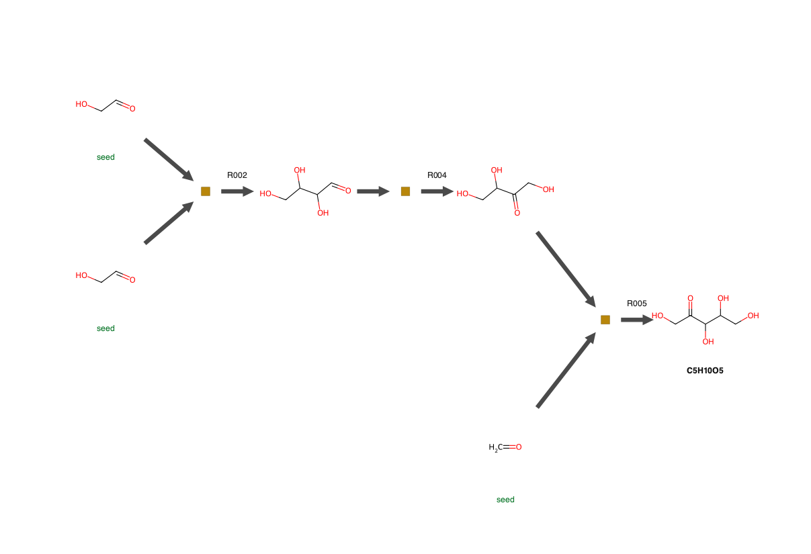

# autocycle

[](https://github.com/Reaction-Space-Explorer/autocycle/actions/workflows/ci.yml)
[](https://opensource.org/licenses/MIT)
[](https://www.python.org/downloads/)

Publication figures for reaction **cycles** and synthetic **routes**, with 2D structures
drawn inline at one constant bond length.

Two layouts behind one spec:

| | Layout | What the figure shows |
|---|---|---|
| `Cycle` | ring | the step where the autocatalyst returns, and the thermodynamic bottleneck |
| `Pathway` | layered, target on the right | where a route bottoms out in seeds, and where it merely stopped |


*A cycle found in a reaction network: gold ring molecules, magenta feeders and products,
reaction ids with ΔG, the autocatalyst ringed in green, rules listed underneath.*

## Install

Needs Python >= 3.10.

```bash
uv pip install git+https://github.com/Reaction-Space-Explorer/autocycle
```

From a checkout, or to run the tests:

```bash
uv venv --python 3.12 && uv pip install -e ".[dev]" && pytest -q
```

Or without installing anything:

```bash
uvx --python 3.12 --from git+https://github.com/Reaction-Space-Explorer/autocycle autocycle --help
```

## Examples

A cycle from a YAML spec:

```bash
autocycle draw examples/formose_gain.yaml -o cycle.svg --drop O
```

A cycle found in a `source,target` edge list:

```bash
autocycle list examples/edges.csv                     # what cycles are in there
autocycle from-edges examples/edges.csv --cycle 0 --gain-at 3 -o cycle.svg
```

A synthetic route:

```bash
autocycle route examples/ribose_route.yaml -o route.svg
autocycle route-smiles \
  --reaction "C=O.C=O>>OCC=O" --reaction "OCC=O.OCC=O>>OCC(O)C(O)C=O" \
  --target "OCC(O)C(O)C=O" -o route.svg
```



From Python:

```python
from autocycle import Cycle, Mol, Side, Step, render

c = Cycle(
    nodes=[Mol("OCC=O"), Mol("OCC(O)C=O"), Mol("OCC(O)C(O)C=O")],
    steps=[
        Step("r1", "Aldol", dg=-16.4, consumes=[Side("C=O")]),
        Step("r2", "Aldol", dg=-13.4, consumes=[Side("C=O")]),
        Step("r3", "Retro-aldol", dg=-9.4, mag=2.0, gain=True, produces=[Side("OCC=O")]),
    ],
    seed=0,
)
open("cycle.svg", "w").write(render(c))
```

Whole corpora, with a report:

```bash
autocycle bench cycles_dir/ --sample 5                  # Cypher ring-query CSVs
autocycle bench-routes routes_dir/ --seeds products.tsv --rels rels.tsv --sample 5
```

## Whole figures

A network search returns a distribution, not one cycle. `panel` emits the published figure
shape in one file: a frequency histogram by cycle length, stratified by distinct feeder
count, plus example cycles, tagged A, B, C.

```bash
autocycle panel cycles_dir/ --sample 3 --style annotated -o figure.png
```

Cycle length is counted in bipartite edges by default, twice the molecule count, matching
the published axis; `--length molecules` counts molecules instead. Any command writes
`.svg`, or `.png` / `.pdf` with `pip install "autocycle[raster]"`.


## Does the cycle actually qualify?

Orgel's distinction, as stated by Peretó: a **simple** cycle regenerates one reactant
stoichiometrically, so the molecule produced replaces the one consumed; an
**autocatalytic** cycle "exhibits an additional yield of the feeder", n > 1. The
distinction is a stoichiometric coefficient.

The published search adds a **shunt**: a bridging path from a ring molecule back to the
seed. Its SI states the rationale directly — such shunts "ensure that the target 'begin
molecule' is generated in a stoichiometric quantity greater than one, which is a minimal
definition of self-amplification" — while noting it carries no flow constraint for mass
balance. `autocycle` reads the shunt, draws it as an outer arc, and reports it as its own
condition.

`autocycle.verify` reports each condition rather than a boolean:

```python
from autocycle.verify import verify
v = verify(cycle)
v.status        # autocatalytic | topological | simple | candidate | incomplete
v.summary()     # 'candidate (seed_identified=yes, feeder=yes, ... extra_yield=unknown)'
```

`autocatalytic` needs a stated coefficient. `topological` means a shunt is present, which
is the published criterion but not mass balance. A source with neither gets
`extra_yield=unknown` and stays a **candidate** — never asserted, never dismissed as
simple. On the glucose-degradation corpus all 2100 cycles are `topological`: every one
carries a shunt, and none carries a coefficient. That is also why the readers set no gain
flag, and `verify` reports any spec that declares one the conditions cannot support.

## Choosing which cycle to show

A network search returns thousands of cycles, most of them not worth a figure. `list` and
`bench` report two things that decide it:

- **distinct feeder count** — a cycle fed by one molecule is a stronger result than one
  needing three. `from-edges --rank` orders by fewest feeders, then lightest feeder.
- **cycle centrality** — `select.cycle_centrality` is the lowest centrality among the ring
  molecules, a second ranking axis for when the feeder count cannot separate candidates.
- **restricted molecules on the ring** — a cycle running *through* formaldehyde or methanol
  is usually not what you want to present: methanol in particular is hard to oxidise or
  reduce without a catalyst, so such a cycle is hard to interpret. Flagged, never dropped,
  and the set is configurable.

## Styles

Every style renders both a cycle and a route. `--style` picks one.

<table>
<tr><th width="180">Style</th><th>Cycle</th><th>Route</th></tr>
<tr>
<td><b><code>paper</code></b><br>default<br><br>Bare structures, ochre reaction
squares, dark-grey flow arrows, pale-grey side arrows, bare ΔG numbers.
Follows <i>Chem. Sci.</i> 2022, <b>13</b>, 4838 Fig. 7.</td>
<td></td>
<td></td>
</tr>
<tr>
<td><b><code>annotated</code></b><br><br>Discs mark <i>roles</i>: gold for the
autocatalyst or target, magenta for off-cycle feeders and products, nothing for
intermediates. Reaction ids with energies inside the ring, water balance as text
rather than drawn, rules listed underneath.</td>
<td></td>
<td></td>
</tr>
<tr>
<td><b><code>rich</code></b><br><br>The spare ink becomes data: arrow
<b>width</b> = magnitude (<code>--mode linear|log|multiples</code>),
<b>hue</b> = ΔG, <b>concentric pair</b> = reversible, <b>green band</b> = the
gain step. Adds a legend with the ΔG scale and cycle total.</td>
<td></td>
<td></td>
</tr>
</table>

No style is a pixel reproduction of a published figure: the layout and encodings match, the
structures are drawn by RDKit or obabel rather than by the original code.

### Structure depictions

RDKit by default, which needs nothing extra. `--backend obabel` uses Open Babel if it is on
your `PATH` (`brew install open-babel`, `apt install openbabel`), which draws small molecules
more legibly — formaldehyde as `O = CH₂` rather than a bare `=O` — and matches the published
figures more closely. Every depiction is drawn at one constant bond length either way, so a
hexose and a water molecule keep their relative size.

## What it will not do

- A step failing a ΔG filter is **greyed, not deleted**.
- `total_dg` is `None`, never a partial sum, if any step lacks a ΔG.
- A route leaf is `seed`, `untraced`, or `unknown` — a leaf whose status the source never
  stated is never assumed to be a seed.
- Reactions in a treelib route file are matched by **content**, not by position in the
  `Reaction IDs` list: treelib sorts children when printing, so positions disagree.
  Unmatched reactions stay `unresolved` and are counted.
- `bench-routes` counts targets whose file has a header but no tree. No route found is a
  result, not something to skip.

## Citing

The cycle layout, the feeder/consumer convention and the thermodynamic annotation follow:

> Arya, A.; Ray, J.; Sharma, S.; Cruz Simbron, R.; Lozano, A.; Smith, H. B.; Andersen, J. L.;
> Chen, H.; Meringer, M.; Cleaves, H. J. **An open source computational workflow for the
> discovery of autocatalytic networks in abiotic reactions.** *Chem. Sci.* **2022**, *13*,
> 4838–4853. [doi:10.1039/D2SC00256F](https://doi.org/10.1039/D2SC00256F)

> Cruz-Simbron, R.; Sharma, S.; Arya, A.; Ray, J.; Lozano, A.; Andersen, J. L.; Chen, H.;
> Cleaves, H. J. **Combined Network and High Resolution Mass Spectrometry Analysis of the
> Formose Reaction Reveals Mechanisms for Emergent Behaviors.** *ChemRxiv* **2024**.
> [doi:10.26434/chemrxiv-2024-nj0p6](https://doi.org/10.26434/chemrxiv-2024-nj0p6)

The simple-versus-autocatalytic criterion is Orgel's, as stated in:

> Peretó, J. **Out of fuzzy chemistry: from prebiotic chemistry to metabolic networks.**
> *Chem. Soc. Rev.* **2012**, *41*, 5394.
> [doi:10.1039/C2CS35054H](https://doi.org/10.1039/C2CS35054H)

Arrow width encoding magnitude, with an explicit linear/log choice, and reversible steps as
concentric arrow pairs, are from Catacycle:

> McFarlane, J.; Henderson, B.; Donnecke, S.; McIndoe, J. S. **An Information-Rich Graphical
> Representation of Catalytic Cycles.** *Organometallics* **2019**, *38*, 4051–4053.
> [doi:10.1021/acs.organomet.9b00563](https://doi.org/10.1021/acs.organomet.9b00563)
> · [code](https://github.com/brettrhenderson/Catacycle_Web) (MIT)

The geometry here is an independent SVG implementation of that design.

MIT.
