# autocycle

[](https://github.com/Reaction-Space-Explorer/autocycle/actions/workflows/ci.yml)
[](https://opensource.org/licenses/MIT)
[](https://www.python.org/downloads/)

Figures for reaction **cycles** and synthetic **routes**, from a YAML spec or from a network
search. Structures are drawn inline, all at one bond length.

<p align="center">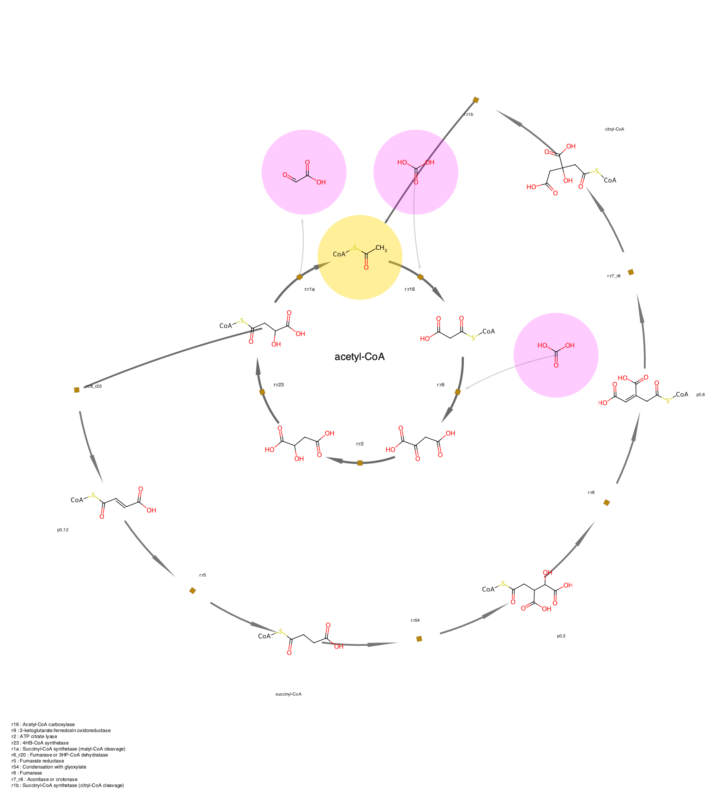</p>

The shortest autocatalytic acetyl-CoA cycle of
[Abel et al. 2026](https://doi.org/10.1038/s41540-025-00641-8), Fig. 3 Solution 0, from
[one spec](examples/canonical/acetyl_coa_sol0.yaml). Discs mark roles: gold the
autocatalyst, magenta off-cycle feeders and products, none for intermediates. Five
molecules on the inner ring, a six-step shunt on the outer arc with its own intermediates,
11 steps, reproducing that paper's objective value and its acetyl-CoA balance of one in and
two out.

## Simple or autocatalytic

| | |
|---|---|
| 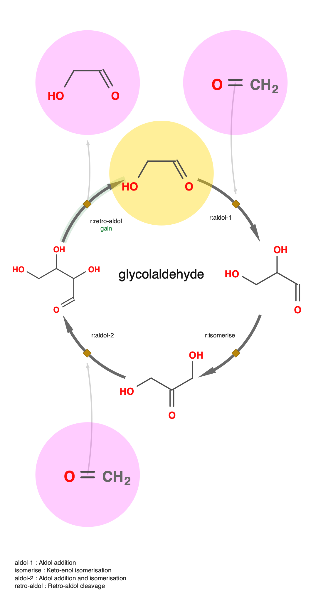 | 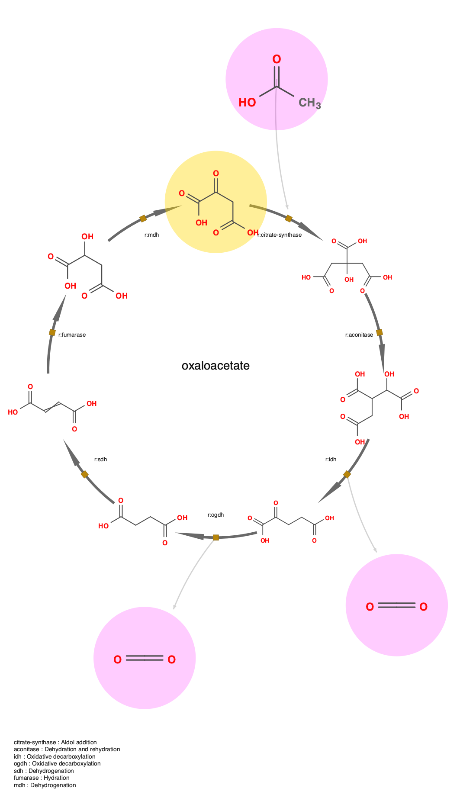 |
| `autocatalytic`: the formose core returns two glycolaldehyde for one, n = 2, the overall reaction `HOCH2CHO + 2 H2CO -> 2 HOCH2CHO` as stated by Andersen et al. | `simple`: each turn of the TCA cycle regenerates one oxaloacetate, n = 1. |

Orgel's distinction is a stoichiometric coefficient. Andersen, Flamm, Merkle and Stadler
give the network form: a composite reaction is formally autocatalytic for x when it reads
`(A) + m x -> n x + (W)` with n > m. `verify` reports the conditions behind that rather
than a boolean:

```python
verify(cycle).status    # autocatalytic | topological | simple | candidate | incomplete
verify(cycle).summary() # 'candidate (seed_identified=yes, ... extra_yield=unknown)'
```

- `autocatalytic`: an extra copy of the seed is stated. Side species on a shunt count, which
  is usually where it is made.
- `topological`: a shunt bridges a ring molecule back to the seed, but no coefficient is
  recorded. The published search treats this as the minimal criterion for n > 1, noting it
  carries no flow constraint for mass balance. All 2100 cycles in the glucose corpus.
- `simple`: stoichiometry is stated and there is no extra copy, n = 1.
- `candidate`: the structure holds but nothing settles the yield. Never asserted, never
  dismissed.

`verify` also flags a spec that declares a gain step its conditions cannot support.

### Steady state

`verify` reads the coefficients a source states. `sna` reads the cycle as Clarke does, as a
stoichiometric matrix with a current `v`:

```
$ autocycle verify examples/canonical/acetyl_coa_sol0.yaml
status     autocatalytic
seed yield n = 2
overall    2 O=C(O)O  ->  1 *SC(C)=O
atoms      * +1, S +1, O -5, H -1
currents   2 (not a single extreme current)
```

- **intermediates balance**: a ring molecule the drawing never returns is named, exit 1.
- **atoms balance**: products minus reactants. Carbon is the load-bearing one; suppressing
  water and protons leaves a residual in H and O. This found a missing carboxylation in two
  of the specs here.
- **one extreme current, or a sum**: Sol 0 of Abel et al. is two, an allocatalytic ring plus
  a loop through the shunt that carries all the autocatalysis.

`flux` is that current; `mag` only sets arrow width.

## Whole searches

Frequency by cycle length, stratified by distinct feeder count, with example cycles.

<p align="center">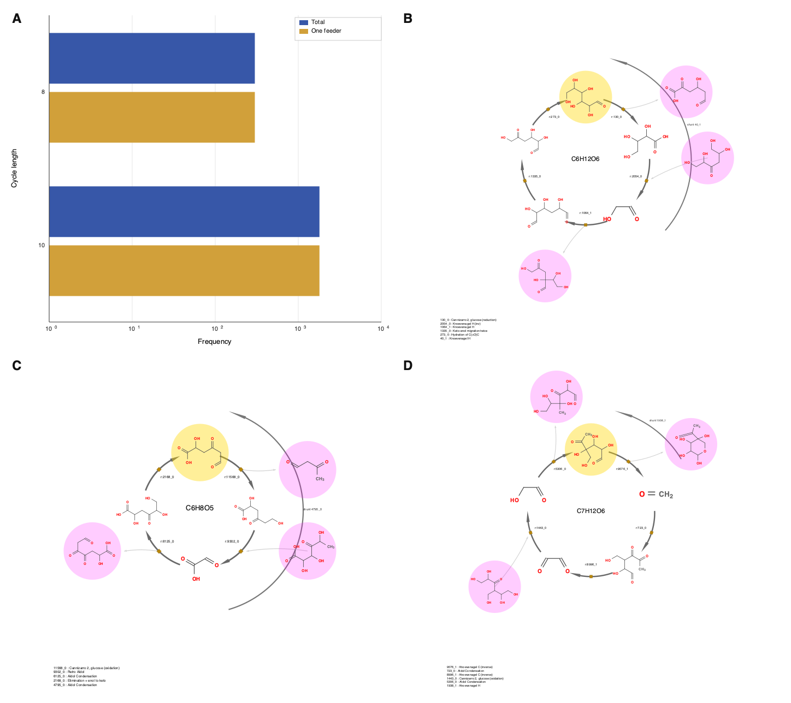</p>

## Install

Python >= 3.10.

```bash
uv pip install git+https://github.com/Reaction-Space-Explorer/autocycle
```

From a checkout, or to run the tests:

```bash
uv venv --python 3.12 && uv pip install -e ".[dev]" && pytest -q
```

## Use

```bash
# a cycle or a route from YAML
autocycle draw examples/canonical/formose_core.yaml --style annotated -o cycle.svg
autocycle route examples/ribose_route.yaml -o route.pdf

# check the stoichiometry without drawing anything
autocycle verify examples/canonical/formose_core.yaml

# a cycle found in a source,target edge list
autocycle list examples/edges.csv
autocycle from-edges examples/edges.csv --cycle 0 --rank -o cycle.svg

# a whole corpus: report, then the multi-panel figure
autocycle bench cycles_dir/ --sample 5
autocycle panel cycles_dir/ --sample 3 -o figure.png
```

Output is `.svg`, or `.png` / `.pdf` with `pip install "autocycle[raster]"`.

```python
from autocycle import Cycle, Mol, Side, Step, render
from autocycle.verify import verify

c = Cycle(
    nodes=[Mol("OCC=O"), Mol("OCC(O)C=O"), Mol("OCC(O)C(O)C=O")],
    steps=[
        Step("r1", "Aldol", dg=-16.4, consumes=[Side("C=O")]),
        Step("r2", "Aldol", dg=-13.4, consumes=[Side("C=O")]),
        Step("r3", "Retro-aldol", dg=-9.4, gain=True, produces=[Side("OCC=O")]),
    ],
    seed=0,
    stoichiometry_complete=True,
)
verify(c).status          # 'autocatalytic'
open("cycle.svg", "w").write(render(c))
```

## Inputs and exports

| Read | |
|---|---|
| YAML spec | cycles and routes, the canonical form, including a `shunt` block |
| reaction SMILES | `from-smiles`, `route-smiles` |
| `source,target` CSV | `list`, `from-edges`, via networkx |
| Cypher ring-query CSV | `bench`, `panel`: ring, shunt, feeders, generations |
| treelib route files | `bench-routes`, with a seed table and reaction table |
| CatReNet `.crs` | `from-crs`. Species are abstract names, so figures carry no chemistry |

Unknown YAML keys are an error, so a typo cannot quietly change a verdict:

| | Keys |
|---|---|
| top level | `title`, `seed`, `stoichiometry_complete`, `nodes`, `steps`, `subcycles`, `shunt` |
| node | `smiles`, `label`, `generation`, `structure` |
| step | `id`, `rule`, `dg`, `mag`, `flux`, `rev_mag`, `consumes`, `produces`, `gain`, `filtered`, `note` |
| side species | `smiles`, `count`, `generation`, `structure` |
| `shunt` | `from_node`, `nodes`, `steps` |
| `subcycles` entry | `at_step`, `nodes`, `steps`, `label` |
| route node | `mol`, `from`, `reaction`, `terminal`, `generation` |

| Write | |
|---|---|
| SVG, PNG, PDF | any command, via `-o` |
| SBGN-PD (SBGN-ML) | `autocycle sbgn spec.yaml`. Lossy, see below |

## Styles

| Style | Cycle | Route |
|---|---|---|
| **`paper`** (default)<br>Bare structures, ochre reaction squares, bare ΔG. Follows *Chem. Sci.* 2022, **13**, 4838 Fig. 7. | 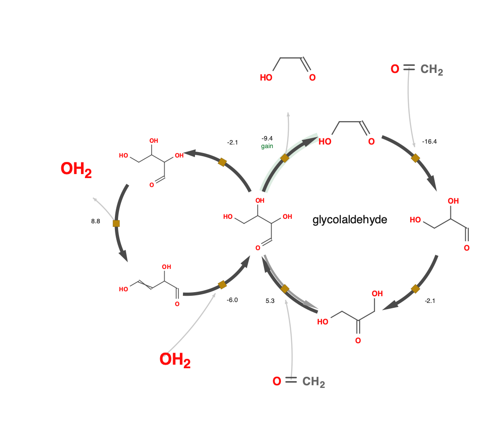 | 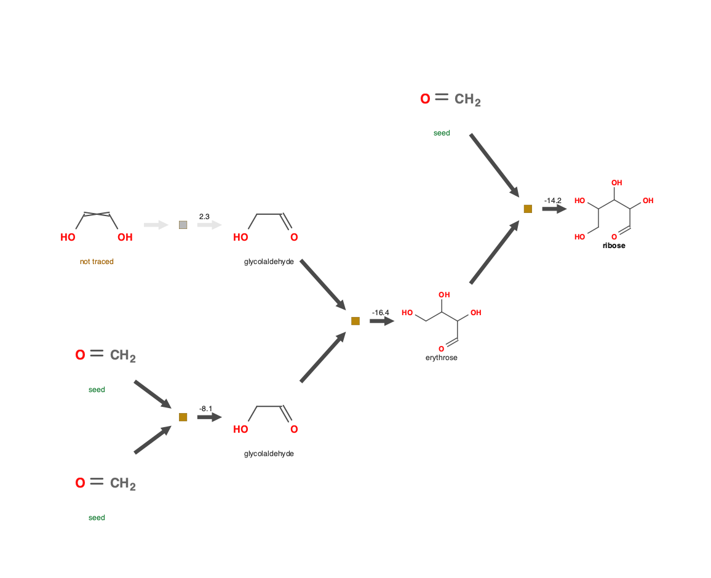 |
| **`annotated`**<br>Discs mark roles, reaction ids with energies inside the ring, water balance as text, rules listed underneath. | 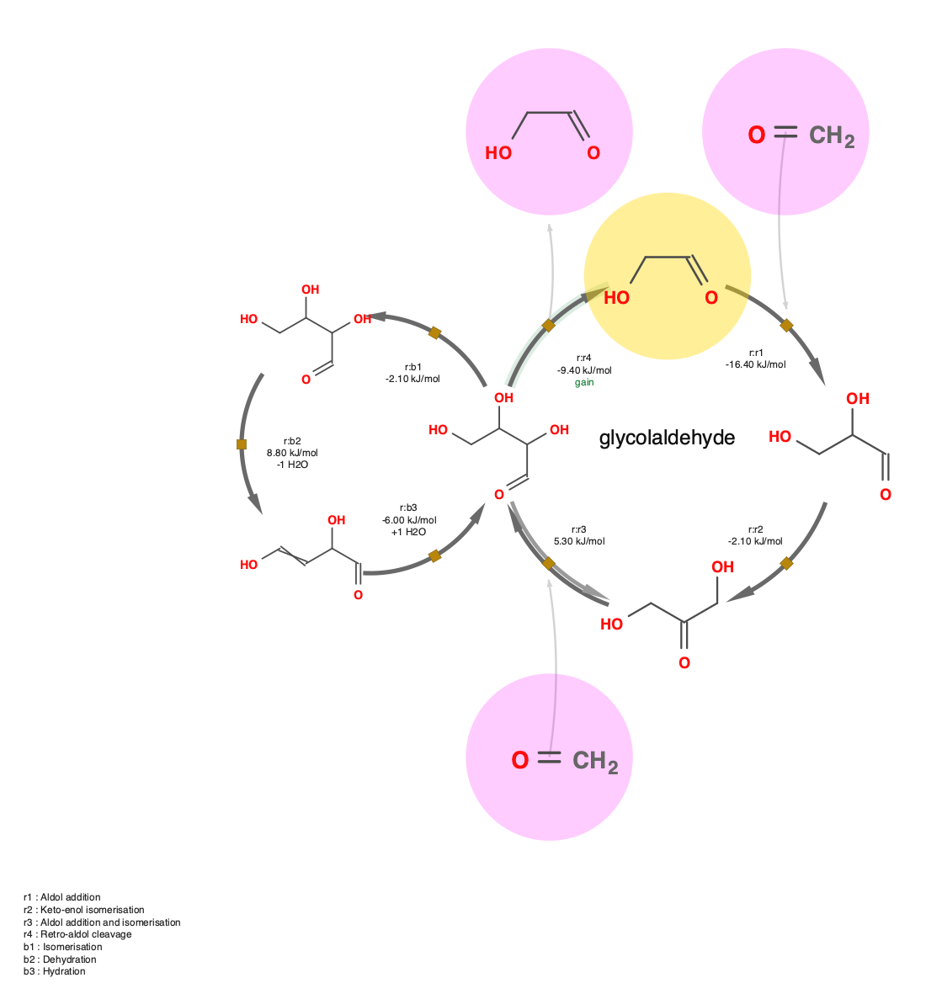 | 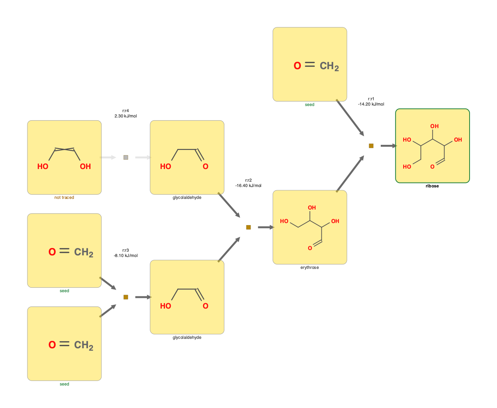 |
| **`rich`**<br>Arrow width = magnitude (`--mode linear\|log\|multiples`), hue = ΔG, concentric = reversible, green band = gain. | 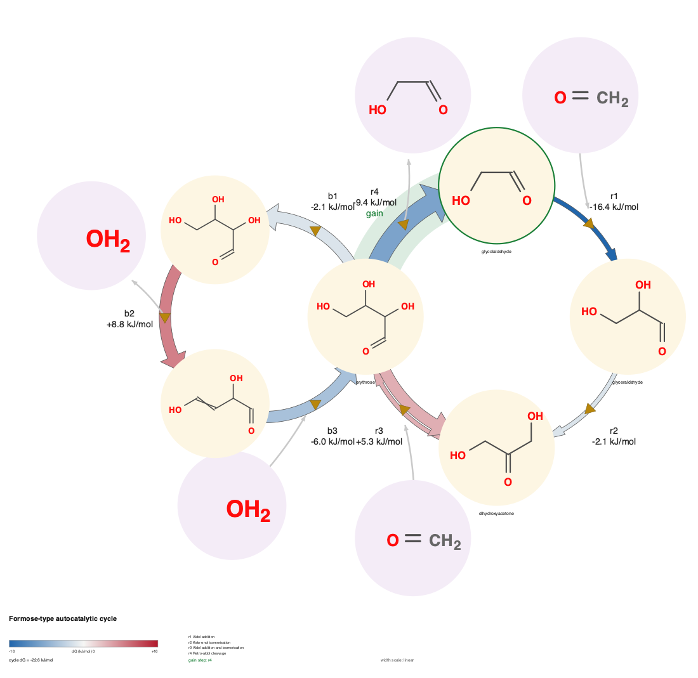 | 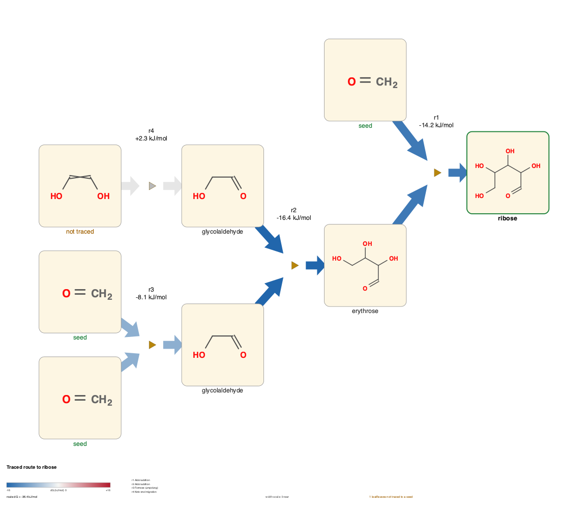 |

Structures come from RDKit, or from Open Babel with `--backend obabel`, which renders small
molecules more legibly (`O = CH₂` rather than a bare `=O`). Within a figure every depiction
uses one bond length: a requested length is honoured only while a molecule fits its canvas,
so the widest molecule sets the scale for all of them.

R-groups work. A pseudo-atom such as the `[CoA]` stub used by MØD parses directly, so SMILES
can be pasted from supplementary data, and the stub draws as `CoA-S-`.

No style is a pixel reproduction of a published figure. The layout and encodings match; the
structures are drawn by RDKit or Open Babel rather than by the original code.

## Choosing which cycle to show

A search returns thousands. `list` and `bench` report what decides it:

- **distinct feeder count**: one feeder is a stronger result than three. `--rank` orders by
  fewest feeders, then lightest, then earliest generation.
- **cycle centrality**: `select.cycle_centrality`, the lowest closeness centrality on the
  ring, which is Zubarev's definition, for when feeder count cannot separate candidates.
- **restricted molecules on the ring**: methanol is hard to oxidise or reduce without a
  catalyst, so a cycle running through it is hard to interpret. Flagged, never dropped.

Unedited search output, fused seven-membered rings included:

<p align="center">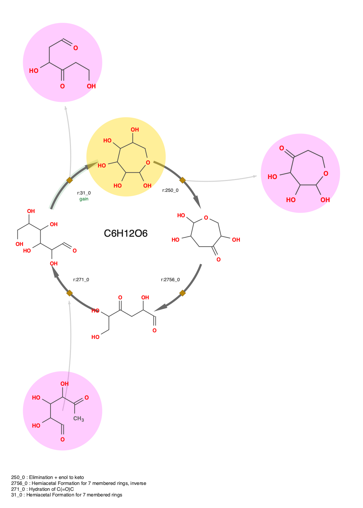</p>

## What it will not do

- A step failing a ΔG filter is greyed, not deleted. `total_dg` is `None`, never a partial sum.
- A route leaf is `seed`, `untraced` or `unknown`, never assumed to be a seed.
- Reactions in a treelib file are matched by content, not by position in `Reaction IDs`:
  treelib sorts children when printing, so positions disagree. Unmatched stay `unresolved`.
- `bench-routes` counts targets whose file has a header but no tree. No route found is a result.
- SBGN-PD has no glyph for a shunt or for stoichiometric gain, so that export records them
  as notes.
- `verify` reads a ring and its shunt as one current. A fused sub-cycle is a separate
  current, reported as a note rather than folded into the balance.

## Benchmark

| | cycles | routes |
|---|---|---|
| source | 31 Cypher result files | three treelib corpora |
| parsed | 2100 of 3100 rows | 8396 routes |
| rejected | 1000, pinched ring paths | 585 targets with no tree |
| reactions resolved by content | | 54254, none unresolved |
| overlapping depictions | 0 | 0 |

The 1000 rejections visit a molecule twice, so `ringMols` has repeats and does not match
`ringRels`. They are named, not repaired. `check.collisions` is the overlap gate the tests
use, so layout regressions fail the suite.

## Published cycles surveyed

`verify` applied to three families of published autocatalytic cycles, each found by a
different method:

| Source | Method | Cycles | Verdict |
|---|---|---|---|
| Arya et al. 2022, glucose corpus | Cypher motif query | 2100 | 2100 `topological`, 0 coefficient-confirmed |
| Abel et al. 2026, flow solutions | MØD with ILP | 15 | 15 `autocatalytic`, net gain 1 each |
| CatReNet examples | RAF sets | 498 | 0 coefficient-confirmed; `.crs` species are abstract, so no coefficient is recorded |

The difference is what each method records, not how good the cycles are. An ILP flow query
constrains the target's outflow to exceed its inflow, so its solutions state a coefficient
and the criterion is settled: `autocycle.io_flow` reads the balance straight off the
Overall Data tables (11 steps for acetyl-CoA, 12 for malate, matching that paper's Table 1).
A motif query matches a shunt instead, which is topological evidence without mass balance.
The RAF row says nothing against RAF sets: Golnik et al. prove that under mild conditions
any RAF is stoichiometrically autocatalytic. It records only that a `.crs` file carries no
coefficients for `verify` to read.

Reproduce with `bench`, `bench-routes`, `io_flow.read_flow_summary` on a summary exported
by `pdftotext -layout`, and `from-crs` on a `.crs` file.

## Citing

The cycle layout, the feeder/consumer convention and the thermodynamic annotation follow:

> Arya, A.; Ray, J.; Sharma, S.; Cruz Simbron, R.; Lozano, A.; Smith, H. B.; Andersen, J. L.;
> Chen, H.; Meringer, M.; Cleaves, H. J. **An open source computational workflow for the
> discovery of autocatalytic networks in abiotic reactions.** *Chem. Sci.* **2022**, *13*,
> 4838–4853. [doi:10.1039/D2SC00256F](https://doi.org/10.1039/D2SC00256F)

> Cruz-Simbron, R.; Sharma, S.; Arya, A.; Ray, J.; Lozano, A.; Andersen, J. L.; Chen, H.;
> Cleaves, H. J. **Combined Network and High Resolution Mass Spectrometry Analysis of the
> Formose Reaction Reveals Mechanisms for Emergent Behaviors.** *ChemRxiv* **2024**.
> [doi:10.26434/chemrxiv-2024-nj0p6](https://doi.org/10.26434/chemrxiv-2024-nj0p6)

The formal criterion, `(A) + m x -> n x + (W)` with n > m, is Definition 1 of:

> Andersen, J. L.; Flamm, C.; Merkle, D.; Stadler, P. F. **Defining Autocatalysis in
> Chemical Reaction Networks.** *J. Syst. Chem.* **2020**, *8*, 121–133.
> [arXiv:2107.03086](https://arxiv.org/abs/2107.03086)

The simple versus autocatalytic distinction is Orgel's, as stated in:

> Peretó, J. **Out of fuzzy chemistry: from prebiotic chemistry to metabolic networks.**
> *Chem. Soc. Rev.* **2012**, *41*, 5394. [doi:10.1039/C2CS35054H](https://doi.org/10.1039/C2CS35054H)

The steady-state reading, `nu.v = 0` with `v >= 0` and its cone of extreme currents, is:

> Clarke, B. L. **Stoichiometric Network Analysis.** *Cell Biophys.* **1988**, *12*,
> 237–253.

Cycle centrality, the lowest closeness centrality on a ring, is:

> Zubarev, D. Y.; Rappoport, D.; Aspuru-Guzik, A. **Uncertainty of Prebiotic Scenarios: The
> Case of the Non-Enzymatic Reverse Tricarboxylic Acid Cycle.** *Sci. Rep.* **2015**, *5*,
> 8009. [doi:10.1038/srep08009](https://doi.org/10.1038/srep08009)

On the relationship between the frameworks the survey compares:

> Blokhuis, A.; Lacoste, D.; Nghe, P. **Universal motifs and the diversity of autocatalytic
> systems.** *PNAS* **2020**, *117*, 25230–25236.
> [doi:10.1073/pnas.2013527117](https://doi.org/10.1073/pnas.2013527117)

> Golnik, R.; Gatter, T.; Hordijk, W.; Stadler, P. F.; Vassena, N. **Bridging two
> theoretical frameworks of autocatalysis: RAF sets and stoichiometric autocatalysis.**
> **2026**. [arXiv:2605.25523](https://arxiv.org/abs/2605.25523)

Arrow width encoding magnitude, with an explicit linear/log choice, and reversible steps as
concentric arrow pairs, are from Catacycle:

> McFarlane, J.; Henderson, B.; Donnecke, S.; McIndoe, J. S. **An Information-Rich Graphical
> Representation of Catalytic Cycles.** *Organometallics* **2019**, *38*, 4051–4053.
> [doi:10.1021/acs.organomet.9b00563](https://doi.org/10.1021/acs.organomet.9b00563)
> · [code](https://github.com/brettrhenderson/Catacycle_Web) (MIT)

MIT.
